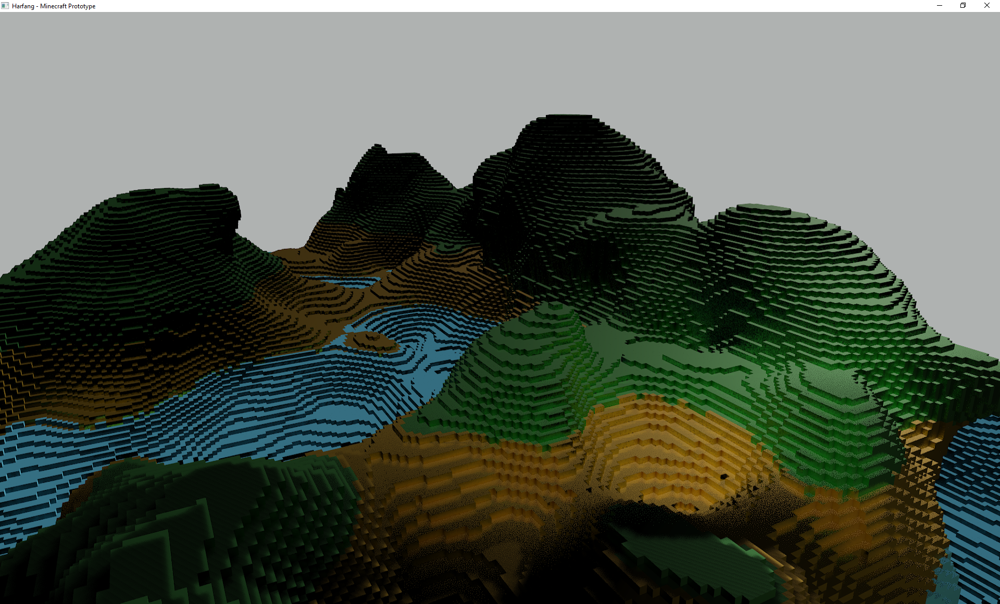
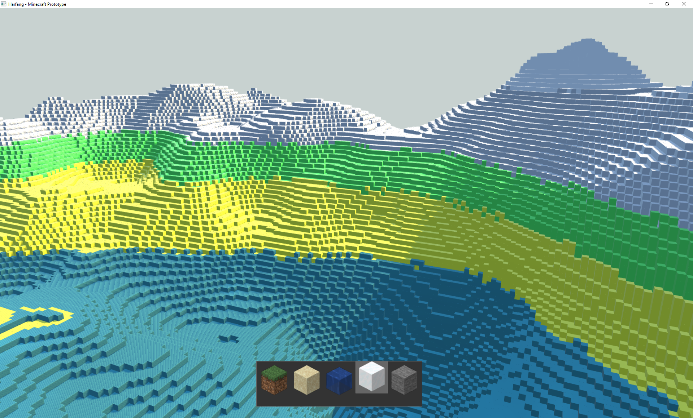
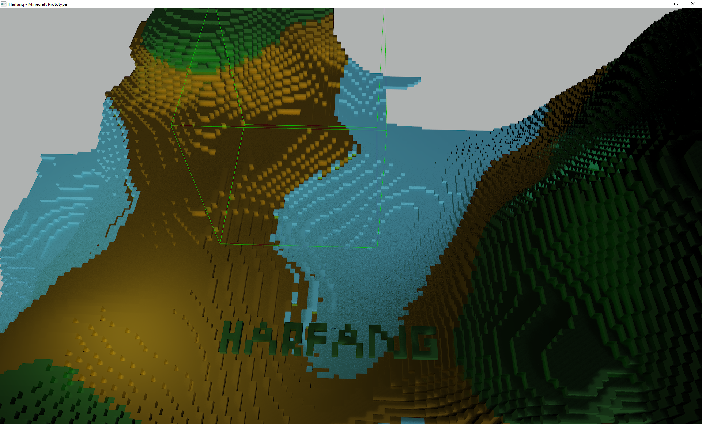
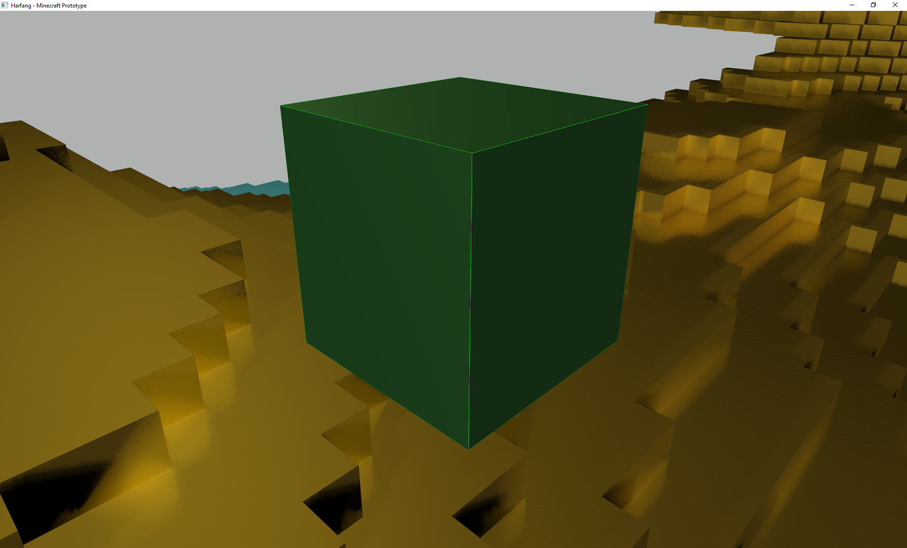

# HARFANG® Minecraft Prototype

This **prototype** demonstrate the usage of Minecraft Mechanics (chunks, procedural world generation) using the HARFANG API in **Python**.

To run the prototype:

1. Download or clone this repository to your computer _(eg. in `d:/minecraft_prototype`)_.
2. Download _assetc_ for your platform from [here](https://harfang3d.com/releases) to compile the resources.
3. Drag and drop the resources folder on the assetc executable **-OR-** execute assetc passing it the path to the resources folder _(eg. `assetc d:/minecraft_prototype/resources`)_.


After the compilation process finishes, you will see a `resources_compiled` folder next to the tutorials resources folder.

You can now execute the prototype from the folder you unzipped it to.

```bash
D:\minecraft_prototype>python "mcgen 1.02.py"
```

## Screenshots
* Using the AAA Rendering Pipeline


* Using the basic Rendering Pipeline


* Placing blocks 


